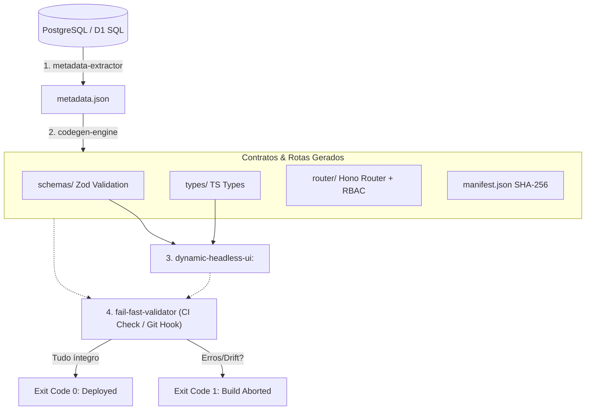

<div align="center">
  <h1>🎟️ BD-Ticket Engine</h1>
  <p><strong>A Schema-Driven Type-Safe Engine for Modern Fullstack Web Apps</strong></p>

  <p>
    <a href="https://typescriptlang.org"></a>
    <a href="https://nodejs.org"></a>
    <a href="https://hono.dev"></a>
    <a href="https://zod.dev"></a>
    <a href="https://react.dev"></a>
    <a href="https://jestjs.io"></a>
    <a href="https://opensource.org/licenses/MIT"></a>
  </p>

  <p>O <strong>BD-Ticket Engine</strong> é um motor de desenvolvimento guiado a esquemas (Schema-Driven) que automatiza a geração de validações, tipos estáticos e rotas protegidas a partir de metadados e tags de documentação direto de bancos PostgreSQL/SQLite para o React e Hono, forçando conformidade estrita e impedindo drifts manuais de código no CI/CD.</p>
</div>

---

## 🗺️ Visual Architecture Flow

O ciclo de vida do motor opera em um pipeline fechado que traduz a modelagem física do banco de dados em contratos e interfaces reativas no frontend:



---

## ⚡ Quickstart (O Jeito Fácil)

Para injetar o motor do **BD-Ticket Engine** dentro de qualquer repositório de projeto legado ou novo:

```bash
# Execute o transplante indicando o diretório alvo
npx tsx scripts/transplant.js --target ../seu-projeto-alvo
```

O script criará a estrutura física de arquivos, injetará os scripts npm utilitários no `package.json` de destino e listará as dependências necessárias de instalação.

---

## 🧱 Os 4 Pilares da Engenharia

### 1. 🔍 Metadata Extractor
Varre o catálogo de tabelas físicas (`information_schema` do PostgreSQL ou `PRAGMA table_info` do SQLite local) decodificando comentários lógicos em JSON (etiquetas de campos) e exporta um arquivo intermediário determinístico `_reversa_sdd/metadata.json` ordenado alfabeticamente.

### 2. ⚙️ Codegen Engine
Carrega o `metadata.json` e escreve automaticamente esquemas Zod (`Insert/Update/Select`), tipos TypeScript estáticos inferidos e rotas do Hono vinculadas a validadores `zValidator` e middlewares RBAC. Grava um manifesto SHA-256 de todas as saídas geradas para monitorar alterações locais.

### 3. ⚛️ Dynamic Headless UI
Uma biblioteca React funcional que consome as definições de metadados e schemas gerados para auto-montar formulários reativos do React Hook Form com validação local, propagação híbrida de privilégios (`BDTicketProvider`) e suporte a slots customizados.

### 4. 🚨 Fail-Fast Validator
Auditor estático CLI para ambientes locais e esteiras de CI/CD (e.g. GitHub Actions). Compara os hashes físicos dos contratos contra os SHA-256 do manifesto e escaneia recursivamente o diretório `src/` em busca de chamadas órfãs a esquemas obsoletos, quebrando o build (Exit Code 1) em caso de drift.

---

## 🛠️ Guia de Comandos NPM

Ao injetar o motor, os seguintes comandos de CLI ficam disponíveis no `package.json`:

| Comando | Descrição |
|---------|-----------|
| `npm run db:extract-metadata` | Executa o extrator de esquemas gerando o `metadata.json`. |
| `npm run db:codegen` | Executa o gerador de schemas Zod, tipos TS, rotas Hono e hashes. |
| `npm run db:validate` | Executa o auditor de drift SHA-256 e varredura de referências órfãs de UI. |
| `npm run test` | Roda a suíte completa de testes automatizados via Jest. |

---

## 🤝 Contribuição e Licença

Consulte o arquivo [CONTRIBUTING.md](file:///c:/Users/Doto/Desktop/PROJETOS-2026/REVERSA-V3/BD-TICKET/CONTRIBUTING.md) para detalhes de desenvolvimento local. Distribuído sob a licença **MIT**.
