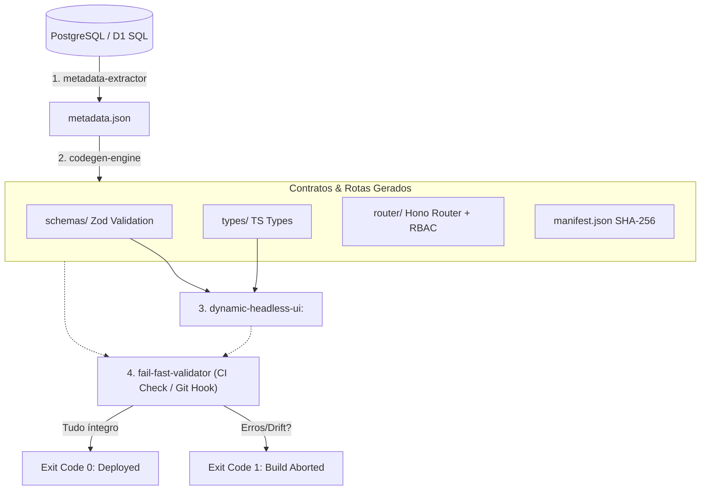

<div align="center">
  <h1>🎟️ BD-Ticket Engine</h1>
  <p><strong>A Schema-Driven Type-Safe Engine for Modern Fullstack Web Apps</strong></p>

  <p>
    <a href="https://github.com/dotojr123/bd-ticket-engine/actions/workflows/ci.yml"></a>
    <a href="https://typescriptlang.org"></a>
    <a href="https://nodejs.org"></a>
    <a href="https://hono.dev"></a>
    <a href="https://zod.dev"></a>
    <a href="https://react.dev"></a>
    <a href="https://jestjs.io"></a>
    <a href="https://opensource.org/licenses/MIT"></a>
  </p>

  <p>O <strong>BD-Ticket Engine</strong> é um motor de desenvolvimento guiado a esquemas (Schema-Driven) que automatiza a geração de validações, tipos estáticos e rotas protegidas a partir de metadados e tags de documentação direto de bancos PostgreSQL/SQLite para o React e Hono, forçando conformidade estrita e impedindo drifts manuais de código no CI/CD.</p>
</div>

---

## 🗺️ Visual Architecture Flow

O ciclo de vida do motor opera em um pipeline fechado que traduz a modelagem física do banco de dados em contratos e interfaces reativas no frontend:



---

## ⚡ Quickstart (O Jeito Fácil)

Para injetar o motor do **BD-Ticket Engine** dentro de qualquer repositório de projeto legado ou novo:

```bash
# Execute o transplante indicando o diretório alvo
npx tsx scripts/transplant.js --target ../seu-projeto-alvo
```

O script criará a estrutura física de arquivos, injetará os scripts npm utilitários no `package.json` de destino e listará as dependências necessárias de instalação. Prefere um passo a passo interativo? `npx bd-ticket-init` faz as mesmas perguntas (framework, driver de banco, tabelas a incluir) com um wizard guiado.

**Novo no motor?** Siga o [tutorial Zero to Hero](docs/zero-to-hero.md) — de um diretório vazio a uma API CRUD real rodando em menos de 10 minutos, sem Docker.

---

## 📦 Exemplos Executáveis

| Exemplo | O que demonstra |
|---------|------------------|
| [`examples/basic-sqlite`](examples/basic-sqlite) | Fluxo mínimo: SQLite → metadata → codegen → servidor Hono com CRUD real. `npm install && npm run setup && npm run dev`. |
| [`examples/postgres-rbac`](examples/postgres-rbac) | RBAC com múltiplos papéis, permissão em nível de linha (`owner_field`) e rate limiting — com um script (`npm run demo`) que exercita tudo isso automaticamente. |
| [`examples/react-frontend`](examples/react-frontend) | `<DynamicForm />` + hooks React Query gerados, consumindo o backend do `basic-sqlite` — zero `fetch` escrito à mão. |

Cada exemplo tem seu próprio `README.md` com os passos exatos e foi validado rodando de ponta a ponta (não é pseudocódigo).

---

## 🧱 Os 4 Pilares da Engenharia

### 1. 🔍 Metadata Extractor
Varre o catálogo de tabelas físicas (`information_schema` do PostgreSQL ou `PRAGMA table_info` do SQLite local) decodificando comentários lógicos em JSON (etiquetas de campos) e exporta um arquivo intermediário determinístico `_reversa_sdd/metadata.json` ordenado alfabeticamente.

### 2. ⚙️ Codegen Engine
Carrega o `metadata.json` (validado estruturalmente antes de rodar) e escreve automaticamente esquemas Zod (`Insert/Update/Select`), tipos TypeScript inferidos, rotas Hono com **CRUD real** (via `DbClient` Postgres/SQLite, paginação/ordenação/filtro, checagem de integridade de FK, soft delete opcional, transações) protegidas por RBAC verificado via **JWT real**, e hooks React Query tipados para o frontend consumir sem escrever `fetch` manualmente. Grava um manifesto SHA-256 de todas as saídas geradas para monitorar alterações locais.

### 3. ⚛️ Dynamic Headless UI
Uma biblioteca React funcional que consome as definições de metadados e schemas gerados para auto-montar formulários reativos do React Hook Form com validação local, propagação híbrida de privilégios (`BDTicketProvider`), campos de relacionamento (`<RelationSelect />` assíncrono para chaves estrangeiras) e suporte a slots customizados.

### 4. 🚨 Fail-Fast Validator
Auditor estático CLI para ambientes locais e esteiras de CI/CD (e.g. GitHub Actions). Compara os hashes físicos dos contratos contra os SHA-256 do manifesto e varre a AST real (TypeScript Compiler API, não regex em texto bruto) do diretório `src/` em busca de chamadas órfãs a esquemas obsoletos, quebrando o build (Exit Code 1) em caso de drift. Suporta `--fix` para regenerar contratos automaticamente quando detecta drift.

### 5. 🔀 Migrations
Compara snapshots sucessivos do `metadata.json` (isolados por ambiente via `--env`) e gera migrações SQL `UP`/`DOWN` reversíveis. Mudanças destrutivas (coluna/tabela removida, tipo alterado) exigem confirmação explícita via `--force`.

### 6. 🔌 Portabilidade de Framework
O núcleo de segurança (JWT/RBAC, rate limiting) é agnóstico de framework HTTP (`src/lib/runtime/core/`). Além do router Hono (default), o codegen também gera um router **Express** equivalente (`--target express`), reaproveitando o mesmo `crud-engine` — mesma lógica de negócio, dois frameworks. Opcionalmente, também gera um schema **Drizzle ORM** tipado por tabela (`--drizzle postgres|sqlite`) como camada de acesso a dados adicional para quem já fixou o dialeto do projeto.

---

## 🔐 Variáveis de Ambiente

| Variável | Uso | Obrigatória quando |
|----------|-----|---------------------|
| `DATABASE_URL` | Connection string do PostgreSQL | `--driver postgres` no extrator, ou `DB_DRIVER=postgres` em runtime |
| `DB_DRIVER` | `postgres` ou `sqlite` — driver usado pelas rotas geradas em runtime | Sempre (default: `sqlite`) |
| `SQLITE_PATH` | Caminho do arquivo SQLite usado em runtime | `DB_DRIVER=sqlite` (default: `local.db`) |
| `JWT_SECRET` | Chave usada para verificar a assinatura dos JWTs recebidos nas rotas geradas | Sempre que uma rota gerada aceitar tráfego real |
| `PROJECT_NAME` | Nome gravado no `metadata.json` | Opcional |

Veja `.env.example` para o arquivo completo.

---

## 🛠️ Guia de Comandos NPM

Ao injetar o motor, os seguintes comandos de CLI ficam disponíveis no `package.json`:

| Comando | Descrição |
|---------|-----------|
| `npm run db:extract-metadata` | Executa o extrator de esquemas gerando o `metadata.json` (aceita `--dry-run`, `--env <nome>`). |
| `npm run db:codegen` | Executa o gerador de schemas Zod, tipos TS, rotas e hooks React Query (aceita `--dry-run`, `--check-only`, `--env <nome>`, `--target hono\|express\|both`, `--drizzle postgres\|sqlite`). |
| `npm run db:validate` | Executa o auditor de drift SHA-256 e varredura AST de referências órfãs de UI (aceita `--warn-only`, `--fix` para regenerar contratos automaticamente ao detectar drift). |
| `npm run db:migrate` | Gera migrações SQL `UP`/`DOWN` a partir do diff de metadata (aceita `--driver`, `--force`, `--dry-run`, `--env <nome>`). |
| `npm run test` | Roda a suíte completa de testes automatizados via Jest — inclui testes de integração end-to-end reais contra SQLite, Postgres (via `pg-mem`), Express (via `supertest`) e Drizzle ORM, sem mocks. |
| `npm run typecheck` | Compilação estrita `tsc --noEmit`, sem emitir arquivos. |
| `npm run scan:secrets` | Varre o commit staged atrás de segredos óbvios (também roda automaticamente no pre-commit). |

---

## 🤝 Contribuição e Licença

Consulte o arquivo [CONTRIBUTING.md](file:///c:/Users/Doto/Desktop/PROJETOS-2026/REVERSA-V3/BD-TICKET/CONTRIBUTING.md) para detalhes de desenvolvimento local. Distribuído sob a licença **MIT**.
