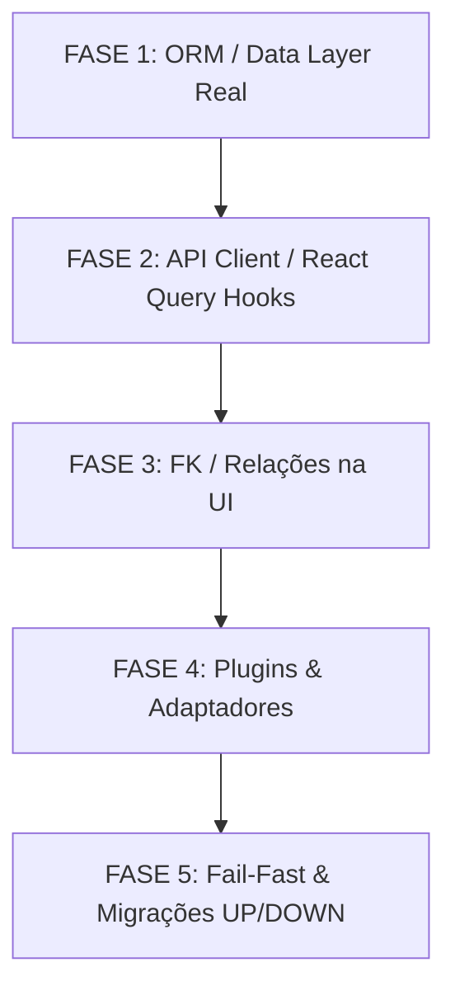

# Documento de Arquitetura e Roadmap: Evolução do BD-Ticket Engine para Nível de Produção (Zero-Touch)

> Identificador: `architecture-roadmap`
> Data: `2026-07-21`
> Status: `Aprovado`
> Âncora: `prd.md` + especificações evolutivas de produção.

---

## 1. Contexto Atual vs. Visão de Futuro

O **BD-Ticket Engine** apresenta uma fundação promissora como um motor *Schema-Driven* focado em automatizar integrações e impedir o *drift* (desvio e quebra) de código entre o banco de dados (PostgreSQL/SQLite) e a aplicação final (React e Hono). Atualmente, o sistema opera extraindo metadados para gerar a infraestrutura primária de contratos: esquemas Zod, tipos TypeScript e o esqueleto de rotas Hono com middleware de acesso (RBAC). 

No entanto, o motor em seu estágio inicial depende de intervenção manual considerável para substituir as respostas falsas (*mocks*) por lógica de negócios real e conectividade prática. Para atingir a promessa de "intervenção manual zero", o projeto deve ser conduzido por fases incrementais de evolução arquitetural.

---

## 2. Lacunas Críticas e Plano de Implementação

### FASE 1: Substituição de *Mocks* por Conectividade Real de Dados (Data Layer)
O **Codegen Engine** atualmente escreve a "casca" das rotas do Hono vinculadas a validadores (`zValidator`), mas não implementa as instruções reais de banco de dados.
*   **O Problema:** Exigir que o desenvolvedor entre no arquivo gerado para codificar o *Insert* ou *Select* manualmente anula o benefício do codegen.
*   **A Evolução:** Expandir o gerador de código para injetar e configurar automaticamente uma camada de ORM (como Prisma ou Drizzle ORM). Ao rodar `npm run db:codegen`, o motor gerará os métodos CRUD completos e reais, perfeitamente tipados e integrados para consultar ou alterar o banco de dados diretamente, fechando o ciclo do backend.

### FASE 2: Geração de Clientes de API (Comunicação Frontend-Backend Automática)
Existe uma lacuna de integração na comunicação de rede entre as telas e o servidor. A biblioteca **Dynamic Headless UI** monta formulários reativos, mas depende de chamadas manuais.
*   **O Problema:** Escrever chamadas HTTP (ex: funções `fetch` ou `axios`) manualmente reintroduz o risco de desalinhamento de contratos.
*   **A Evolução:** Gerar automaticamente *hooks* de conexão (ex: clientes baseados em React Query ou ferramentas de RPC seguras) derivados dos tipos TypeScript gerados. A interface gráfica consumirá esses *hooks* nativamente, submetendo os formulários e tratando erros automaticamente, sem nenhuma linha extra de código de integração.

### FASE 3: Evolução da Lógica Relacional na Interface (Dynamic Headless UI)
A **Dynamic Headless UI** consome o `metadata.json` para montar formulários locais baseados em React Hook Form. Isso funciona para campos simples, mas peca em layouts relacionais.
*   **O Problema:** A interface de chamados não pode solicitar que o usuário digite IDs numéricos (Foreign Keys) manualmente.
*   **A Evolução:** Aprimorar o extrator de metadados para compreender chaves estrangeiras (*Foreign Keys*) e relacionamentos profundos. A biblioteca de UI proverá componentes inteligentes que, ao identificar um relacionamento `1:N`, montem de forma transparente menus suspensos (*Dropdowns*) assíncronos que consultam a tabela relacionada no servidor.

### FASE 4: Arquitetura de Plugins e Desacoplamento
O motor atual foi construído como um monólito altamente específico, forçando o uso de tecnologias exatas (React, Hono, Zod, PostgreSQL/SQLite).
*   **O Problema:** A restrição tecnológica limita o reaproveitamento de componentes em outras stacks existentes.
*   **A Evolução:** Refatorar a base do projeto para uma arquitetura baseada em adaptadores (*Adapters/Plugins*). O núcleo (*Core*) deve orquestrar a lógica de mapeamento, permitindo que a comunidade desenvolva "plugins geradores" para outros ecossistemas (ex: Vue.js, Angular, Node.js puro, MySQL, MongoDB), tornando a ferramenta verdadeiramente agnóstica.

### FASE 5: Refinamento do "Guarda-Costas" (Fail-Fast Validator) e CI/CD
O pilar **Fail-Fast Validator** já é uma das ferramentas mais promissoras, projetado para comparar hashes SHA-256 e barrar implantações caso haja quebras entre os contratos de banco e a interface.
*   **O Problema:** Ele impede que a aplicação suba quebrada, mas não orienta a recuperação nem protege contra perda de dados causadas por migrações mal executadas.
*   **A Evolução:** Integrar o validador com ferramentas de migração de banco de dados (ex: comandos `UP/DOWN`). O auditor fornecerá alertas proativos sobre alterações destrutivas em colunas ativas no pré-commit, antes do código ser comitado.

---

## 3. Diretrizes de Desenvolvimento Futuro

Para guiar qualquer desenvolvedor ou agente autônomo nas próximas iterações:
- **Zero-Touch:** Nenhuma modificação manual deve ser exigida dentro das pastas `/src/contracts/` ou nos arquivos de rotas auto-gerados.
- **Strict Validation:** A compilação estrita (`npm run build`) e a auditoria de conformidade (`npm run db:validate`) devem fazer parte do pipeline de commit e pull request de todos os projetos que adotarem o BD-Ticket Engine.
